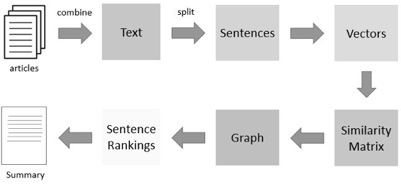

# Digital-Content-Summariser:An extractive text summariser
Partial automation of content analysis phase for project involving Knowledge capture. Applied Natural Language Processing algorithm 'Textrank' to build this prototype, which was able to summarise and analyse 10-page long documents.

 <h3><b>Approach used: </b></h3>
 
 
 
1. Concatenate all the text contained in the articles.
2. Then split the text into individual sentences.
3. In the next step, find vector representation (word embeddings) for each and every sentence.
4. Similarities between sentence vectors are then calculated and stored in a matrix.
5. The similarity matrix is then converted into a graph, with sentences as vertices and similarity scores as edges, for sentence rank calculation.
6. Finally, a certain number of top-ranked sentences form the final summary.

 <h3><b>Output: </b></h3>
 
 

<h5><b>References:</b></h5>

1. https://www.analyticsvidhya.com/blog/2018/11/introduction-text-summarization-textrank-python/ 
2. https://nlp.stanford.edu/projects/glove/
